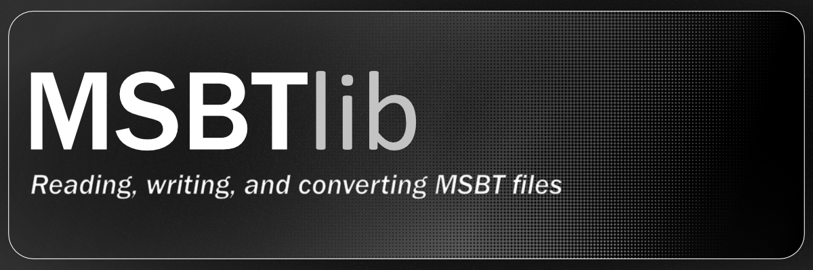

# msbtlib





🚧 Work in progress

**msbtlib** is a Python library for reading, writing, and converting MSBT (Message Script Binary Text) files, commonly used in game localization systems. It aims to make MSBT manipulation easier for modding, tooling, and automation.

## Features

- [x] Basic MSBT parsing
- [x] Basic MSBT writing
- [x] Convert MSBT to Python dictionary
- [ ] Convert MSBT to JSON
- [ ] Improve parsing robustness
- [ ] Hash table support
- [x] Accurate block size calculation
- [ ] Improved ATR1 handling
- [ ] ATO1 handling
- [ ] TSY1 handling
- [ ] Full documentation
- [ ] Edit MSBT text content from Python


## Roadmap

- Enhance parser stability and error handling
- Increase test coverage
- Add a CLI tool for MSBT conversion
- Optimize binary writing performance

## Testing

This project requires MSBT sample files for testing.

To run tests:

1. Place a `.msbt` file inside `tests/data/`
2. Rename it to `example.msbt`
3. Run tests using pytest:

```bash
pytest -s
```

⚠️ Note: MSBT files are proprietary game assets. Only use files extracted from games you legally own.

## Goals
- Provide a clean, reliable MSBT parser and writer in Python
- Make MSBT editing and manipulation straightforward
- Maintain accuracy with reverse-engineered formats
Status

---

This project is under active development. APIs may change frequently as features are added.